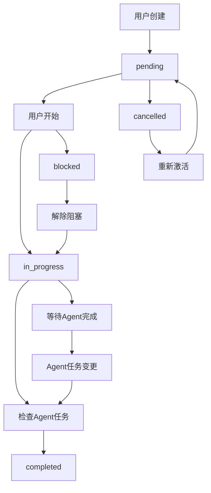
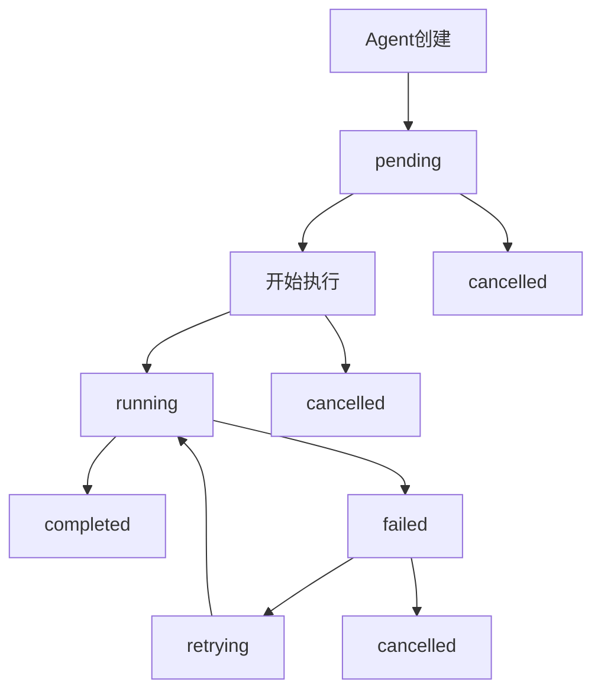

# 任务流转流程

> 本文档描述主任务和Agent任务的状态流转流程

## 核心改动

### 表结构分离
- **主任务表 (tasks)**: 用户创建的业务任务
- **Agent任务表 (agent_tasks)**: Agent创建的执行任务，可关联主任务

### 权限分离
- **用户**: 只能操作主任务
- **Agent**: 只能操作Agent任务

## 主任务状态流转

### 状态定义
- `pending` - 待处理
- `in_progress` - 进行中
- `completed` - 已完成
- `blocked` - 阻塞
- `cancelled` - 已取消

### 流转规则
```text
pending → in_progress, blocked, cancelled
in_progress → completed, blocked, cancelled
blocked → in_progress, cancelled
completed → (终态)
cancelled → pending (重新激活)
```

## Agent任务状态流转

### 状态定义
- `pending` - 待执行
- `running` - 执行中
- `completed` - 已完成
- `failed` - 执行失败
- `cancelled` - 已取消
- `retrying` - 重试中

### 流转规则
```text
pending → running, cancelled
running → completed, failed, cancelled
failed → retrying, cancelled
retrying → running, failed, cancelled
completed → (终态)
cancelled → (终态)
```

## 流程图

### 主任务流程


### Agent任务流程


## 泳道图

```mermaid
journey
    title 任务流转泳道图
    section 用户泳道
        创建主任务 --> 开始任务 --> 等待完成 --> 确认完成
    section 系统泳道
        保存任务 --> 状态变更 --> 进度计算 --> 完成检查
    section Agent泳道
        获取任务 --> 创建子任务 --> 执行任务 --> 报告完成
```

## 完成条件

### 主任务完成条件
- 所有关联的Agent任务状态为 `completed`
- 或用户手动标记完成（忽略Agent任务状态）

### Agent任务完成条件
- Agent执行完成并标记为 `completed`
- 失败重试达到上限后保持 `failed` 状态