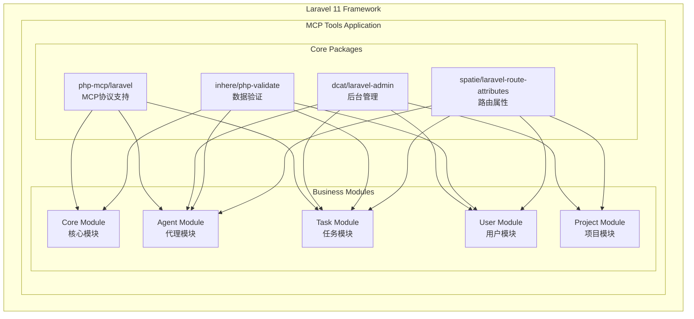

# 包集成总结

## 概述

本文档总结了MCP Tools项目中引入的核心包及其在整体架构中的作用和集成方式。

## 包集成架构图



## 包功能矩阵

| 功能领域 | php-mcp/laravel | dcat/laravel-admin | inhere/php-validate | spatie/laravel-route-attributes |
|---------|-----------------|-------------------|-------------------|--------------------------------|
| **MCP协议** | ✅ 核心实现 | ❌ | 🔄 消息验证 | ❌ |
| **后台管理** | ❌ | ✅ 核心实现 | 🔄 表单验证 | 🔄 路由定义 |
| **API接口** | 🔄 MCP接口 | ❌ | ✅ 请求验证 | ✅ 路由定义 |
| **数据验证** | 🔄 协议验证 | 🔄 表单验证 | ✅ 核心实现 | ❌ |
| **用户管理** | ❌ | ✅ 管理界面 | ✅ 数据验证 | 🔄 路由定义 |
| **任务管理** | ✅ MCP工具 | ✅ 管理界面 | ✅ 数据验证 | ✅ 路由定义 |

**图例**：
- ✅ 主要负责
- 🔄 协作参与
- ❌ 不涉及

## 详细集成说明

### 1. php-mcp/laravel - MCP协议核心

#### 集成位置
- **主要模块**：MCP协议模块
- **协作模块**：Agent模块、Task模块

#### 核心功能
```php
// MCP服务器实现
class McpServer extends BaseMcpServer
{
    protected function registerResources(): void
    {
        $this->addResource('task', app(TaskResource::class));
        $this->addResource('project', app(ProjectResource::class));
    }
    
    protected function registerTools(): void
    {
        $this->addTool('task_management', app(TaskManagementTool::class));
    }
}

// MCP资源实现
class TaskResource extends Resource implements ResourceInterface
{
    public function read(string $uri, array $params = []): array
    {
        // 提供任务数据访问
    }
}

// MCP工具实现
class TaskManagementTool extends Tool implements ToolInterface
{
    public function execute(array $arguments): array
    {
        // 执行任务管理操作
    }
}
```

#### 配置示例
```php
// config/mcp.php
return [
    'server' => [
        'name' => 'MCP Tools Server',
        'transport' => 'sse',
    ],
    'resources' => [
        'task' => TaskResource::class,
        'project' => ProjectResource::class,
    ],
    'tools' => [
        'task_management' => TaskManagementTool::class,
    ],
];
```

### 2. dcat/laravel-admin - 后台管理

#### 集成位置
- **主要模块**：Admin管理模块
- **协作模块**：User、Agent、Task、Project模块

#### 核心功能
```php
// 任务管理控制器
class TaskController extends AdminController
{
    protected function grid(): Grid
    {
        return Grid::make(Task::class, function (Grid $grid) {
            $grid->column('title', '标题');
            $grid->column('status', '状态')->label();
            $grid->column('completion_percentage', '完成度')->progressBar();
        });
    }
    
    protected function form(): Form
    {
        return Form::make(Task::class, function (Form $form) {
            $form->text('title', '标题')->required();
            $form->select('status', '状态')->options([...]);
        });
    }
}
```

#### 管理功能覆盖
- **用户管理**：用户CRUD、角色分配、权限管理
- **Agent管理**：Agent注册、状态监控、权限配置
- **任务管理**：任务监控、进度跟踪、子任务查看
- **项目管理**：项目配置、成员管理、统计分析

### 3. inhere/php-validate - 数据验证

#### 集成位置
- **主要模块**：Core核心模块（ValidationService）
- **协作模块**：所有业务模块

#### 核心功能
```php
class ValidationService
{
    public function validateTaskCreation(array $data): array
    {
        $v = Validation::make($data, [
            'title' => 'required|string|minLen:3|maxLen:255',
            'priority' => 'string|in:low,medium,high,urgent',
            'project_id' => 'required|int|min:1',
        ]);
        
        $v->addMessages([
            'title.required' => '任务标题不能为空',
            'project_id.required' => '必须选择项目',
        ]);
        
        if (!$v->validate()) {
            throw new ValidationException('验证失败', $v->getErrors());
        }
        
        return $v->getSafeData();
    }
    
    public function validateMcpMessage(array $data): array
    {
        $v = Validation::make($data, [
            'jsonrpc' => 'required|string|in:2.0',
            'method' => 'required|string',
            'params' => 'array',
            'id' => 'required|int|string',
        ]);
        
        return $v->validate() ? $v->getSafeData() : 
            throw new ValidationException('Invalid MCP message');
    }
}
```

#### 验证场景
- **API请求验证**：所有REST API的输入验证
- **MCP消息验证**：MCP协议消息格式验证
- **表单验证**：Admin后台表单验证
- **业务规则验证**：复杂业务逻辑验证

### 4. spatie/laravel-route-attributes - 路由属性

#### 集成位置
- **主要模块**：所有包含控制器的模块
- **协作模块**：User、Agent、Task、Project模块

#### 核心功能
```php
#[Prefix('api/v1/tasks')]
#[Middleware(['api', 'auth:sanctum'])]
class TaskController extends Controller
{
    #[Route('GET', '/', name: 'api.tasks.index')]
    public function index(Request $request): JsonResponse
    {
        // 获取任务列表
    }
    
    #[Route('POST', '/', name: 'api.tasks.store')]
    public function store(Request $request): JsonResponse
    {
        // 创建任务
    }
    
    #[Route('GET', '/{task}', name: 'api.tasks.show')]
    #[Where('task', '[0-9]+')]
    public function show(Task $task): JsonResponse
    {
        // 获取任务详情
    }
}

#[Prefix('api/v1/agent')]
#[Middleware(['api', 'agent.auth'])]
class AgentTaskController extends Controller
{
    #[Route('GET', '/tasks', name: 'api.agent.tasks')]
    public function myTasks(Request $request): JsonResponse
    {
        // Agent的任务列表
    }
    
    #[Route('POST', '/tasks/{task}/subtasks', name: 'api.agent.subtasks.create')]
    public function createSubTask(Request $request, Task $task): JsonResponse
    {
        // 创建子任务
    }
}
```

#### 路由组织
- **用户API**：`/api/v1/users/*`
- **Agent API**：`/api/v1/agent/*`
- **任务API**：`/api/v1/tasks/*`
- **项目API**：`/api/v1/projects/*`
- **管理API**：`/admin/*`

## 包间协作模式

### 1. MCP + Validation
```php
// MCP工具中使用验证服务
class TaskManagementTool extends Tool
{
    public function execute(array $arguments): array
    {
        // 使用验证服务验证MCP工具参数
        $validatedArgs = app(ValidationService::class)
            ->validateToolArguments($arguments, $this->getInputSchema());
            
        return $this->performAction($validatedArgs);
    }
}
```

### 2. Admin + Validation
```php
// Admin表单中使用验证服务
class TaskController extends AdminController
{
    protected function form(): Form
    {
        return Form::make(Task::class, function (Form $form) {
            $form->saving(function (Form $form) {
                // 使用验证服务进行额外验证
                app(ValidationService::class)
                    ->validateTaskCreation($form->input());
            });
        });
    }
}
```

### 3. Route Attributes + Validation
```php
// 路由控制器中使用验证服务
#[Route('POST', '/tasks', name: 'tasks.store')]
public function store(Request $request): JsonResponse
{
    // 使用验证服务验证请求数据
    $validatedData = app(ValidationService::class)
        ->validateTaskCreation($request->all());
        
    $task = app(TaskService::class)->create($validatedData, $request->user());
    
    return new TaskResource($task);
}
```

## 性能和优化

### 1. 包加载优化
- **延迟加载**：按需加载包功能
- **缓存机制**：缓存验证规则和路由定义
- **服务单例**：重用包服务实例

### 2. 内存优化
- **资源释放**：及时释放不需要的包资源
- **对象池**：复用验证器和其他对象
- **配置缓存**：缓存包配置避免重复解析

### 3. 性能监控
- **包性能指标**：监控各包的性能表现
- **调用链追踪**：跟踪包间调用关系
- **资源使用统计**：监控包的资源消耗

## 升级和维护

### 1. 版本管理
- **语义化版本**：遵循语义化版本规范
- **兼容性检查**：升级前进行兼容性测试
- **渐进式升级**：分阶段升级包版本

### 2. 依赖管理
- **依赖锁定**：使用composer.lock锁定版本
- **安全更新**：及时应用安全补丁
- **冲突解决**：处理包间版本冲突

### 3. 测试策略
- **包集成测试**：测试包间协作功能
- **回归测试**：确保升级不破坏现有功能
- **性能测试**：验证升级后的性能表现

---

**相关文档**：
- [包集成架构](./package-integration.md)
- [包使用示例](../examples/包使用示例.md)
- [模块架构概述](../modules/模块架构概述.md)
