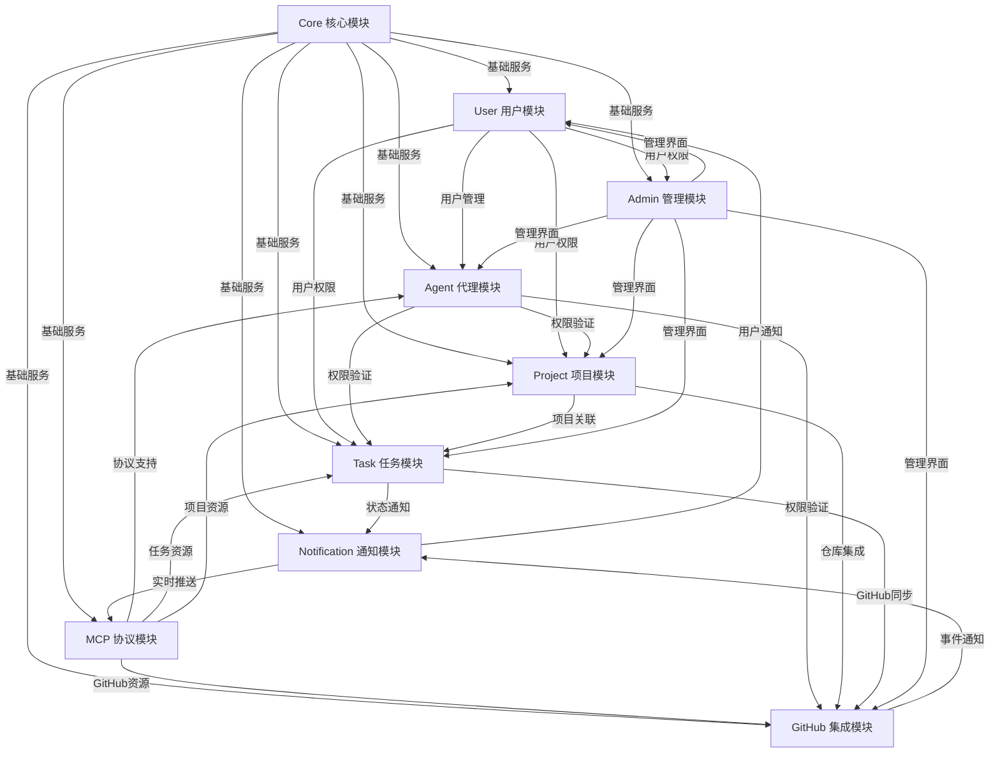

# 模块依赖关系

## 概述

本文档描述了MCP Tools系统中各模块之间的依赖关系，包括直接依赖、间接依赖和循环依赖的处理方案。

## 依赖关系图



## 模块依赖层次

### 第一层：基础设施层
- **Core 核心模块**：提供所有其他模块依赖的基础服务

### 第二层：用户和协议层
- **User 用户模块**：依赖Core，提供用户管理和认证
- **MCP 协议模块**：依赖Core，提供MCP协议实现（专注于任务和资源访问）

### 第三层：代理层
- **Agent 代理模块**：依赖Core、User、MCP，提供Agent管理和认证

### 第四层：业务核心层
- **Project 项目模块**：依赖Core、User、Agent，提供项目管理
- **Task 任务模块**：依赖Core、User、Agent、Project，提供任务管理
- **GitHub 集成模块**：依赖Core、User、Agent、Project，提供GitHub集成

### 第五层：服务层
- **Notification 通知模块**：依赖Core、User、MCP，提供通知服务
- **Admin 管理模块**：依赖所有业务模块，提供管理界面

## 详细依赖关系

### Core 核心模块
**提供服务**：
- 配置管理服务
- 日志记录服务
- 缓存服务
- 事件系统
- 异常处理

**依赖模块**：无

**被依赖模块**：所有其他模块

### User 用户模块
**提供服务**：
- 用户注册和认证
- 用户资料管理
- 角色权限管理
- 会话管理

**依赖模块**：
- Core：基础服务支持

**被依赖模块**：
- MCP：用户认证
- Agent：用户管理
- Project：用户权限
- Task：用户权限
- Admin：用户管理
- Notification：用户通知

### MCP 协议模块
**提供服务**：
- MCP协议实现
- SSE传输服务
- 消息路由
- 连接管理
- 任务和项目资源访问
- GitHub资源访问

**依赖模块**：
- Core：基础服务支持

**被依赖模块**：
- Agent：协议支持
- Notification：实时推送

**MCP职责边界**：
- ✅ 提供任务相关的MCP工具和资源
- ✅ 处理Agent的任务操作请求
- ✅ 管理MCP连接和会话
- ❌ 不直接管理用户账户
- ❌ 不处理用户认证逻辑
- ❌ 不管理用户权限（由Agent模块处理）

### Agent 代理模块
**提供服务**：
- Agent注册和管理
- 身份认证
- 权限控制
- 会话管理

**依赖模块**：
- Core：基础服务支持
- User：用户管理
- MCP：协议支持

**被依赖模块**：
- Project：权限验证
- Task：权限验证
- GitHub：权限验证
- Admin：管理界面

### Project 项目模块
**提供服务**：
- 项目生命周期管理
- 成员管理
- 仓库关联
- 项目统计

**依赖模块**：
- Core：基础服务支持
- User：用户权限
- Agent：权限验证
- MCP：资源访问

**被依赖模块**：
- Task：项目关联
- GitHub：项目仓库
- Admin：管理界面

### Task 任务模块
**提供服务**：
- 任务生命周期管理
- 任务分配
- 状态跟踪
- 工作流管理

**依赖模块**：
- Core：基础服务支持
- Agent：权限验证
- Project：项目关联
- MCP：资源访问

**被依赖模块**：
- GitHub：任务同步
- Notification：状态通知
- Admin：管理界面

### GitHub 集成模块
**提供服务**：
- GitHub API集成
- Issues同步
- Webhook处理
- 仓库管理

**依赖模块**：
- Core：基础服务支持
- Agent：权限验证
- Project：项目仓库
- Task：任务同步
- MCP：资源访问

**被依赖模块**：
- Notification：事件通知
- Admin：管理界面

### Notification 通知模块
**提供服务**：
- 实时通知推送
- 事件监听
- 消息队列
- 通知模板

**依赖模块**：
- Core：基础服务支持
- MCP：实时推送
- Task：状态通知
- GitHub：事件通知

**被依赖模块**：
- Admin：通知管理

### Admin 管理模块
**提供服务**：
- 后台管理界面
- 用户管理
- 系统配置
- 监控面板

**依赖模块**：
- Core：基础服务支持
- Agent：Agent管理
- Project：项目管理
- Task：任务管理
- GitHub：集成管理
- Notification：通知管理

**被依赖模块**：无

## 依赖注入配置

### 服务容器绑定
```php
// app/Providers/AppServiceProvider.php
public function register(): void
{
    // 核心服务绑定
    $this->app->singleton(ConfigInterface::class, ConfigService::class);
    $this->app->singleton(CacheInterface::class, CacheService::class);
    $this->app->singleton(LogInterface::class, LogService::class);

    // 用户服务绑定
    $this->app->singleton(UserServiceInterface::class, UserService::class);
    $this->app->singleton(AuthServiceInterface::class, AuthService::class);
    $this->app->singleton(RoleServiceInterface::class, RoleService::class);

    // MCP服务绑定
    $this->app->singleton(MCPServerInterface::class, MCPServer::class);
    $this->app->singleton(TransportInterface::class, SseTransport::class);

    // Agent服务绑定
    $this->app->singleton(AgentServiceInterface::class, AgentService::class);
    $this->app->singleton(AgentAuthServiceInterface::class, AgentAuthenticationService::class);

    // 业务服务绑定
    $this->app->singleton(ProjectServiceInterface::class, ProjectService::class);
    $this->app->singleton(TaskServiceInterface::class, TaskService::class);
    $this->app->singleton(GitHubServiceInterface::class, GitHubService::class);
}
```

### 模块服务提供者注册顺序
```php
// config/app.php
'providers' => [
    // 1. 核心模块（最先加载）
    App\Modules\Core\Providers\CoreServiceProvider::class,

    // 2. 用户模块
    Modules\User\Providers\UserServiceProvider::class,

    // 3. 协议和认证模块
    Modules\MCP\Providers\MCPServiceProvider::class,
    Modules\Agent\Providers\AgentServiceProvider::class,

    // 4. 业务核心模块
    Modules\Project\Providers\ProjectServiceProvider::class,
    Modules\Task\Providers\TaskServiceProvider::class,
    App\Modules\GitHub\Providers\GitHubServiceProvider::class,

    // 5. 服务模块（最后加载）
    App\Modules\Notification\Providers\NotificationServiceProvider::class,
    App\Modules\Admin\Providers\AdminServiceProvider::class,
],
```

## 循环依赖处理

### 问题识别
当两个或多个模块相互依赖时，会形成循环依赖，可能导致：
- 服务容器无法正确解析依赖
- 模块初始化失败
- 运行时错误

### 解决方案

#### 1. 事件驱动解耦
使用事件系统打破直接依赖：
```php
// 不好的做法：直接依赖
class TaskService
{
    public function __construct(
        private NotificationService $notificationService
    ) {}

    public function updateStatus(Task $task, string $status): void
    {
        $task->status = $status;
        $task->save();

        // 直接调用通知服务
        $this->notificationService->sendTaskStatusUpdate($task);
    }
}

// 好的做法：事件驱动
class TaskService
{
    public function updateStatus(Task $task, string $status): void
    {
        $task->status = $status;
        $task->save();

        // 发布事件，由通知模块监听
        event(new TaskStatusUpdated($task, $status));
    }
}
```

#### 2. 接口抽象
通过接口抽象打破具体实现依赖：
```php
// 定义接口
interface NotificationInterface
{
    public function send(string $message, array $recipients): void;
}

// 服务依赖接口而非具体实现
class TaskService
{
    public function __construct(
        private NotificationInterface $notification
    ) {}
}
```

#### 3. 延迟加载
使用服务定位器模式延迟加载依赖：
```php
class TaskService
{
    private ?NotificationService $notificationService = null;

    private function getNotificationService(): NotificationService
    {
        if ($this->notificationService === null) {
            $this->notificationService = app(NotificationService::class);
        }

        return $this->notificationService;
    }
}
```

## 依赖管理最佳实践

### 1. 单向依赖
- 保持依赖关系的单向性
- 避免双向依赖
- 使用事件系统实现反向通信

### 2. 层次化架构
- 明确模块层次
- 高层模块可以依赖低层模块
- 低层模块不应依赖高层模块

### 3. 接口隔离
- 定义清晰的模块接口
- 依赖接口而非具体实现
- 保持接口的稳定性

### 4. 依赖注入
- 使用构造函数注入
- 避免服务定位器模式
- 保持依赖关系的显式性

### 5. 测试友好
- 使用模拟对象进行单元测试
- 保持依赖关系的可测试性
- 避免静态依赖

## 依赖变更管理

### 1. 版本控制
- 为模块接口定义版本
- 保持向后兼容性
- 提供迁移指南

### 2. 变更通知
- 建立依赖变更通知机制
- 评估变更影响范围
- 协调相关模块更新

### 3. 测试验证
- 进行集成测试
- 验证依赖关系正确性
- 确保系统稳定性

---

**相关文档**：
- [模块架构概述](./模块架构概述.md)
- [开发指南](./开发指南.md)
- [测试指南](../testing.md)
