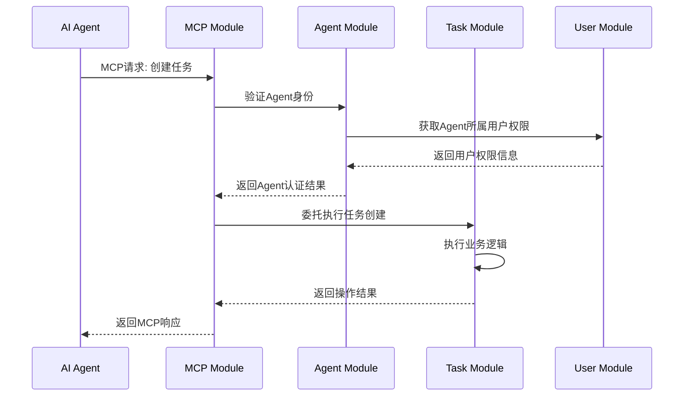

# 模块职责分工矩阵

## 概述

本文档明确定义了MCP Tools系统中各模块的职责边界，特别是MCP协议模块与用户管理的关系。

## 核心原则

### MCP协议的职责边界
- **MCP协议专注于任务处理**：MCP是为AI Agent提供工具和资源访问的协议，不应该直接管理用户
- **用户管理独立**：人类用户的管理由专门的User模块处理
- **Agent管理分离**：AI Agent的管理由Agent模块处理，与人类用户管理分离

## 职责分工矩阵

| 功能领域 | Core | User | MCP | Agent | Project | Task | GitHub | Notification | Admin |
|---------|------|------|-----|-------|---------|------|--------|-------------|-------|
| **用户管理** |
| 用户注册/登录 | | ✅ | ❌ | ❌ | | | | | |
| 用户资料管理 | | ✅ | ❌ | ❌ | | | | | |
| 用户权限管理 | | ✅ | ❌ | ❌ | | | | | |
| 用户会话管理 | | ✅ | ❌ | ❌ | | | | | |
| **Agent管理** |
| Agent注册 | | | ❌ | ✅ | | | | | |
| Agent认证 | | | ❌ | ✅ | | | | | |
| Agent权限控制 | | | ❌ | ✅ | | | | | |
| Agent状态管理 | | | ❌ | ✅ | | | | | |
| **MCP协议** |
| 协议实现 | | | ✅ | | | | | | |
| SSE服务 | | | ✅ | | | | | | |
| 连接管理 | | | ✅ | | | | | | |
| 消息路由 | | | ✅ | | | | | | |
| **任务处理** |
| 任务CRUD | | | 🔄 | | | ✅ | | | |
| 任务状态管理 | | | 🔄 | | | ✅ | | | |
| 任务分配 | | | 🔄 | 🔄 | | ✅ | | | |
| 任务MCP接口 | | | ✅ | | | | | | |
| **项目管理** |
| 项目CRUD | | | ❌ | | ✅ | | | | |
| 项目成员管理 | | 🔄 | ❌ | | ✅ | | | | |
| 项目MCP资源 | | | ✅ | | | | | | |
| **GitHub集成** |
| GitHub API | | | ❌ | | | | ✅ | | |
| Issues同步 | | | ❌ | | | 🔄 | ✅ | | |
| GitHub MCP资源 | | | ✅ | | | | | | |
| **通知系统** |
| 实时推送 | | | 🔄 | | | | | ✅ | |
| 用户通知 | | 🔄 | ❌ | | | | | ✅ | |
| Agent通知 | | | 🔄 | 🔄 | | | | ✅ | |

**图例说明**：
- ✅ 主要负责
- 🔄 协作参与
- ❌ 不负责

## 详细职责说明

### User 用户模块
**主要职责**：
- 人类用户的完整生命周期管理
- 用户认证和授权
- 用户资料和偏好管理
- 用户角色和权限系统

**不负责**：
- AI Agent的管理
- MCP协议实现
- 具体业务逻辑

### MCP 协议模块
**主要职责**：
- 实现MCP 1.0协议标准
- 提供任务相关的Resources和Tools
- 管理SSE连接和消息路由
- 为Agent提供标准化的任务操作接口

**不负责**：
- 用户账户管理
- Agent注册和认证
- 业务逻辑实现
- 数据持久化

**MCP Resources提供**：
- `task://` - 任务资源访问
- `project://` - 项目资源访问（只读）
- `github://` - GitHub资源访问（只读）

**MCP Tools提供**：
- `task_management` - 任务管理工具
- `project_query` - 项目查询工具
- `github_sync` - GitHub同步工具

### Agent 代理模块
**主要职责**：
- AI Agent的注册和管理
- Agent身份认证和授权
- Agent权限控制和验证
- Agent会话和状态管理

**不负责**：
- 人类用户管理
- MCP协议实现
- 具体业务逻辑执行

**与其他模块协作**：
- 从User模块获取Agent所属用户信息
- 为MCP模块提供Agent认证服务
- 为业务模块提供权限验证

### 业务模块（Project, Task, GitHub）
**主要职责**：
- 具体业务逻辑实现
- 数据模型和持久化
- 业务规则验证
- 业务事件发布

**与MCP协作**：
- 接收MCP模块转发的操作请求
- 提供数据给MCP Resources
- 发布事件给Notification模块

## 数据流示例

### Agent执行任务操作的完整流程



### 关键设计原则

1. **单一职责**：每个模块专注于自己的核心职责
2. **协议分离**：MCP协议不直接处理用户管理
3. **权限委托**：MCP通过Agent模块验证权限
4. **业务委托**：MCP将具体操作委托给业务模块
5. **事件驱动**：模块间通过事件进行松耦合通信

## 配置示例

### MCP服务器配置
```php
// config/mcp.php
return [
    'capabilities' => [
        'resources' => true,  // 提供资源访问
        'tools' => true,      // 提供工具调用
        'notifications' => true, // 支持通知
        'user_management' => false, // 不提供用户管理
    ],
    
    'resources' => [
        'task' => true,       // 任务资源
        'project' => true,    // 项目资源（只读）
        'github' => true,     // GitHub资源（只读）
        'user' => false,      // 不提供用户资源
    ],
    
    'tools' => [
        'task_management' => true,
        'project_query' => true,
        'github_sync' => true,
        'user_management' => false, // 不提供用户管理工具
    ],
];
```

### Agent权限配置
```php
// Agent权限示例
$agent = Agent::create([
    'agent_id' => 'agent_001_claude_dev',
    'name' => 'Claude开发助手',
    'user_id' => 1, // 关联到具体用户
    'allowed_projects' => [1, 3, 5],
    'allowed_actions' => [
        'read',
        'create_task',
        'update_task',
        'claim_task',
        // 注意：没有用户管理相关权限
    ],
]);
```

## 总结

通过明确的职责分工，我们确保了：

1. **MCP协议专注于任务处理**，不涉及用户管理
2. **用户管理由专门模块处理**，保持功能内聚
3. **Agent管理独立但协作**，与用户管理分离
4. **清晰的模块边界**，便于维护和扩展
5. **标准化的协作方式**，通过接口和事件通信

这种设计确保了系统的可维护性、可扩展性和符合MCP协议的设计理念。

---

**相关文档**：
- [模块架构概述](./模块架构概述.md)
- [MCP协议模块](./MCP协议模块.md)
- [Agent代理模块](./Agent代理模块.md)
- [用户模块](./用户模块.md)
